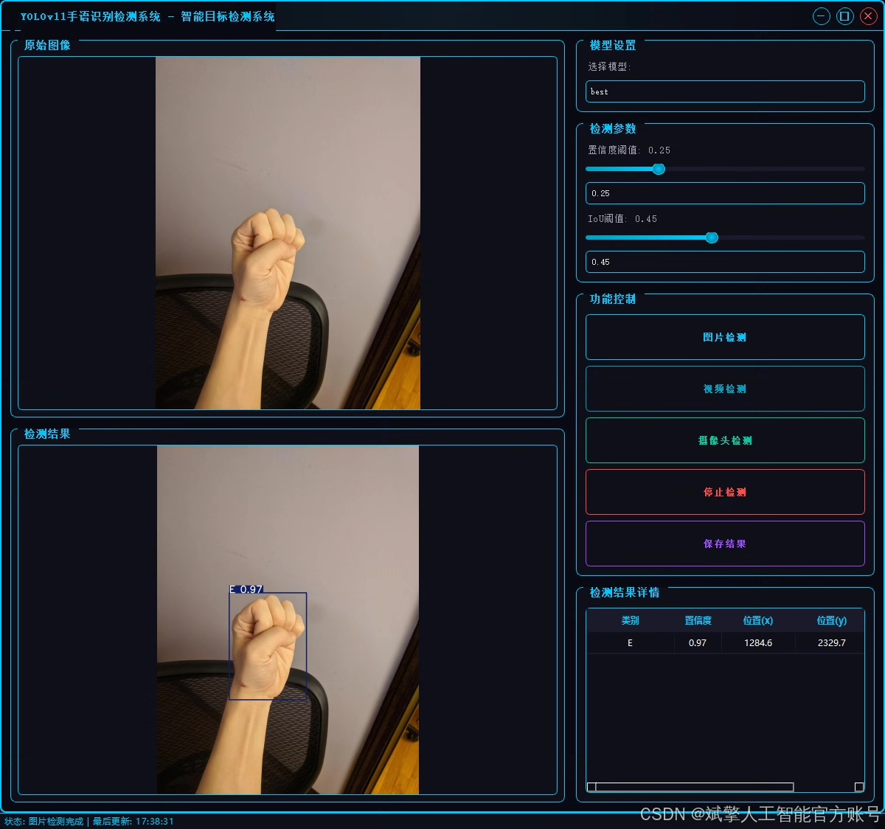
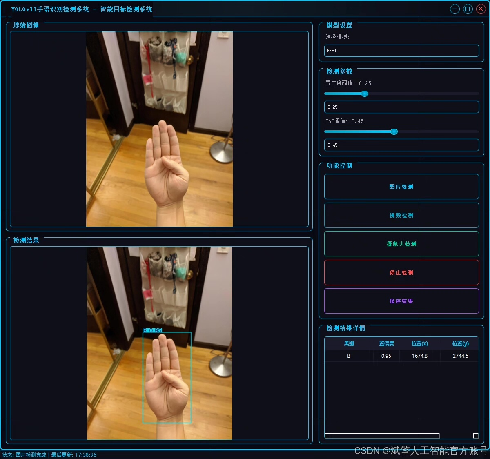
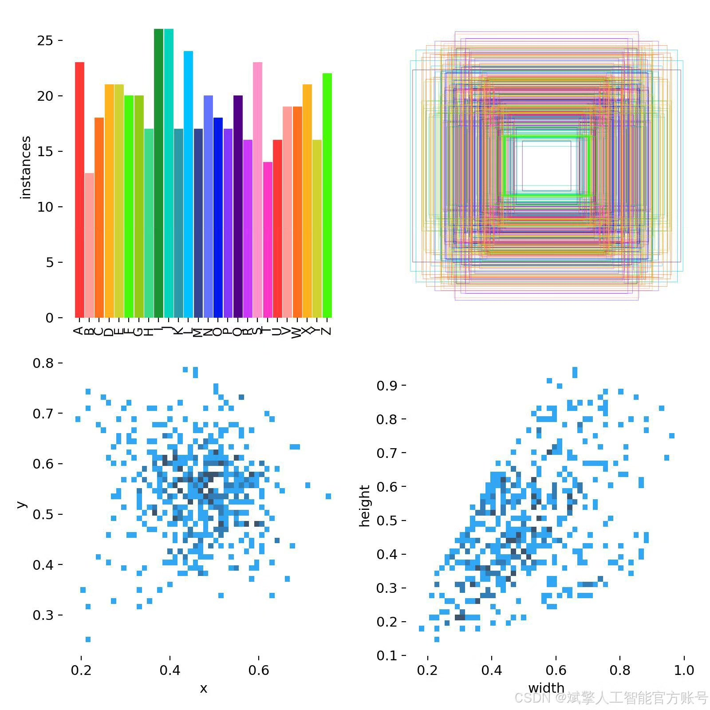
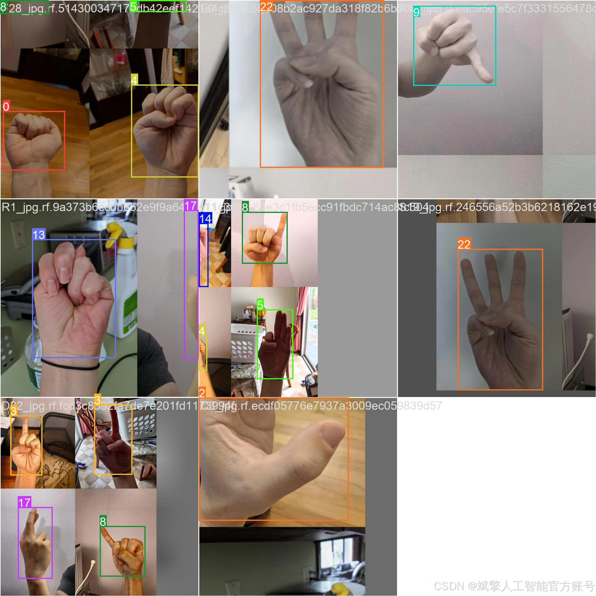
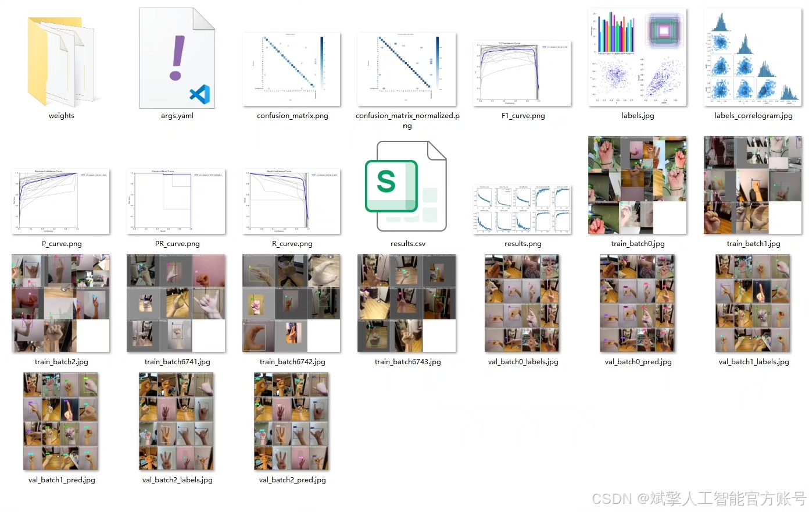
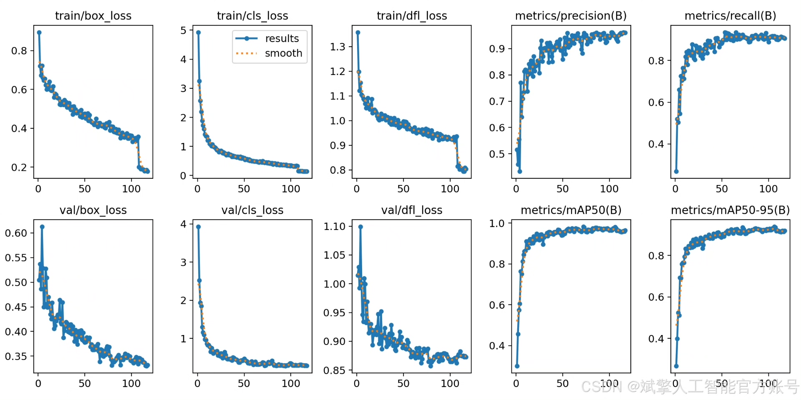
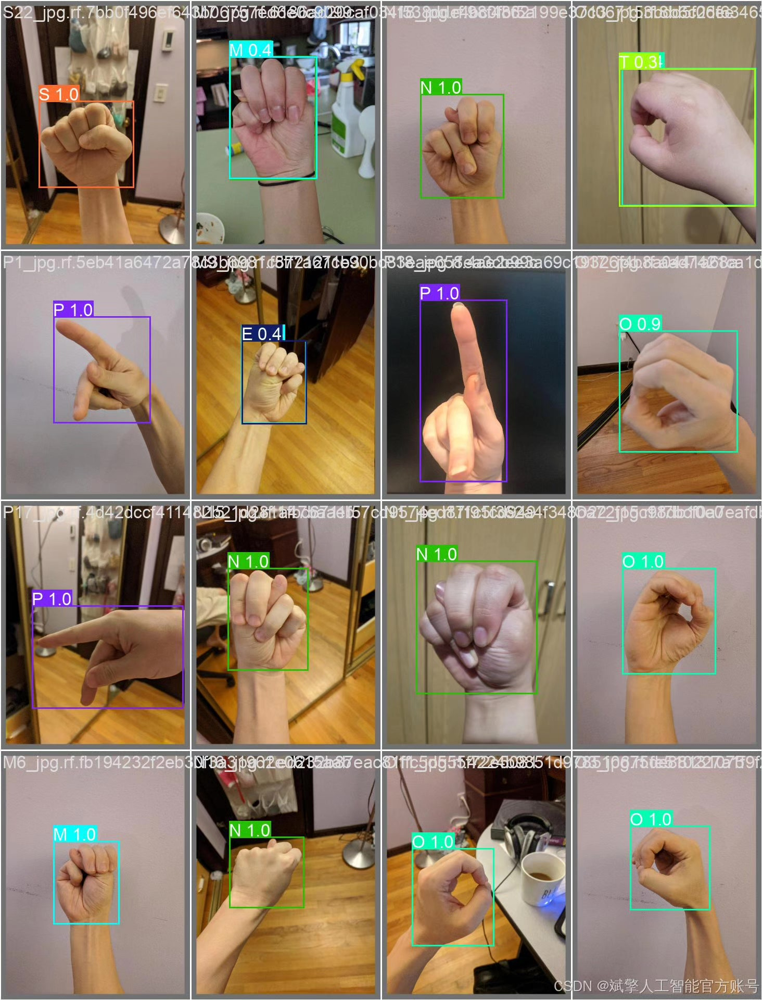
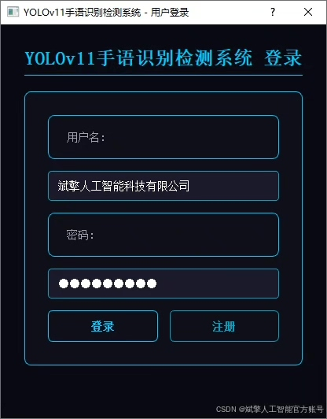
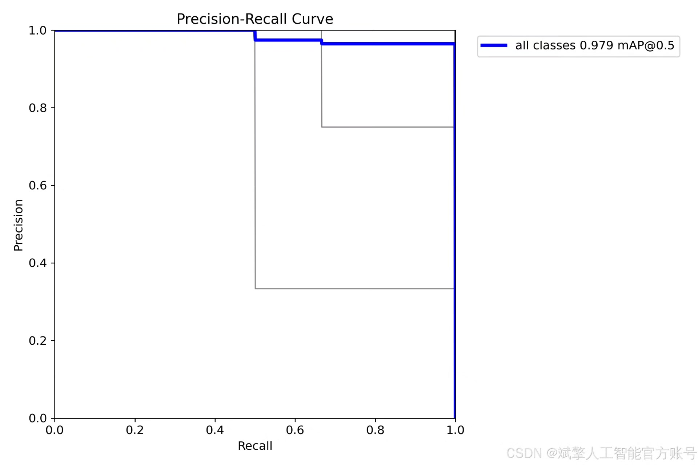

# Based on deep learning YOLOv11 hand gesture recognition detection system (YOLOv11)

## Body

This paper proposes a deep learning-based hand gesture recognition detection system based on YOLOv11, aiming to achieve efficient and accurate real-time detection of hand gesture letters (A-Z). The system employs the YOLOv11 object detection algorithm, combined with a custom YOLO format dataset (including 504 training images, 144 validation images, and 72 test images), to enhance detection performance through data augmentation and model optimization. Additionally, the system is designed with a user-friendly UI interface that integrates login and registration functions. Experimental results show that the system achieves high recognition accuracy on the test set, providing a viable technical solution for hand gesture translation and human-computer interaction.
✅ User Login and Registration: Supports password verification and security validation.
✅ Three detection modes: Based on the YOLOv11 model, supports image, video, and real-time camera detection, accurately recognizing targets.
✅ Dual-screen comparison: Displays the original image and detection results simultaneously on the same screen.
✅ Data visualization: Real-time table displays the category, confidence, and coordinates of detected targets.
✅ Intelligent parameter adjustment: Offers a confidence slide bar to dynamically optimize detection accuracy, adapting to different scene requirements.
✅ Sci-fi style interactive interface: Dark theme paired with dynamic light effects, reducing visual fatigue and enhancing operational experience.

## Images

## Payment

Here is a pay link on Stripe ( https://buy.stripe.com/3cs8yP7sY87d0vu9AB ). Please contact me lonlonago@foxmail.com after funding $89, and I will send you a complete data files , thank you!

